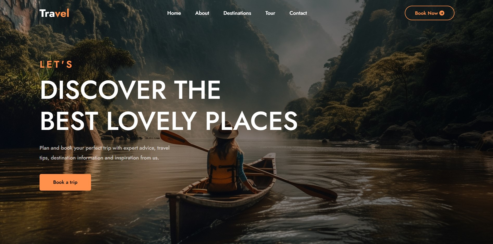

<div align="center">

  <h1 align="center">Travel Tales - Travel & Tour Website</h1>

  A fully responsive travel website landing page <br />Built using HTML, CSS, and JavaScript.

  <a href="https://anshukrra07.github.io/Travel-Tales/"><strong>➥ Live Demo</strong></a>

</div>

<br />

## 📃 Description

I created a landing page for a travel website using HTML, CSS, and JavaScript. My goal was to make a simple, clean, and user-friendly interface.



The landing page includes:
* A header section with the logo and navbar
* Popular destinations section
* Activities section
* Newsletter subscription section
* Footer with social media links

📱 It is fully responsive and works seamlessly across all screen sizes. 📱

## 🚀 Setup/Installation

To view the website:
- Visit the [Travel Tales GitHub Repo](https://github.com/anshukrra07/Travel-Tales)
- Or clone the repo:
```bash
git clone https://github.com/anshukrra07/Travel-Tales.git